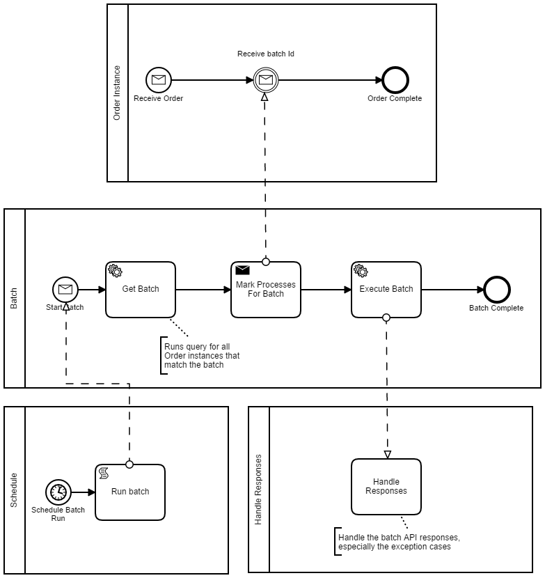

# Batch Processing using camunda BPM and Spring Boot.

### Local Setup
### Maven build / run:
```
mvn clean install spring-boot:run 

// or install + skip test
mvn clean install -Dmaven.test.skip=true 
```

#### Using docker-compose
```
docker-compose up
```

#### Launching app directly to a Docker Postgres DB
```
docker run -p 5432:5432 --name postgresql -e POSTGRES_USER=camunda -e POSTGRES_PASSWORD=camunda -e POSTGRES_ROOT_PASSWORD=camunda -d postgres
mvn spring-boot:run
```
### UI - Camunda Cockpit, TaskList and Admin:

    http://localhost:8080/ 
    Username tom
    Password tom

### Process


### Calls

#### Queue an order
```
curl -X POST \
  http://localhost:8080/rest/engine/default/process-definition/key/OrderReceived/start \
  -H 'Cache-Control: no-cache' \
  -H 'Content-Type: application/json' \
  -d '{"variables":
 {
    "custId" : {"value" : 117, "type": "Long"},
    "eventId" : {"value" : 17, "type": "Long"}
 },
 "businessKey" : "OrderKey"
}
'
```

#### Kick off the batch process for all orders received
```
curl -X POST \
  http://localhost:8080/rest/engine/default/process-definition/key/BatchStart/start \
  -H 'Cache-Control: no-cache' \
  -H 'Content-Type: application/json' \
  -d '{"variables":
 {
    "definitionKey" : {"value" : "OrderReceived", "type": "String"}
 },
 "businessKey" : "BatchKey"
}
'
```


####  Send a message to kick off the batch process for all orders received
```
curl -X POST \
  http://localhost:8080/rest/message \
  -H 'Cache-Control: no-cache' \
  -H 'Content-Type: application/json' \
  -d '{
  "messageName" : "Message_Batch_Start",
  "businessKey" : "BatchKey",
  "all" : true,
  "correlationKeys" : {
    "custId" : {"value" : 115, "type": "Long"}
  }
}'
```


