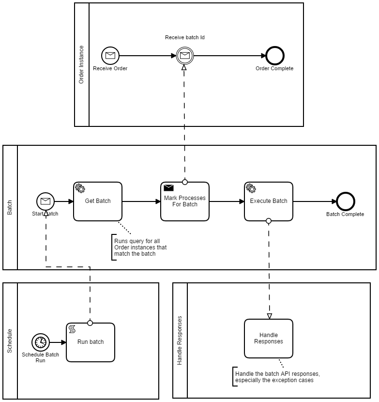

# Batch Processing using camunda BPM and Spring Boot.

### Local Setup
### Maven build / run:
```
mvn clean install spring-boot:run 

// or install + skip test
mvn clean install -Dmaven.test.skip=true 
```

#### Using docker-compose
```
docker-compose up
```

#### Launching app directly to a Docker Postgres DB
```
docker run -p 5432:5432 --name postgresql -e POSTGRES_USER=camunda -e POSTGRES_PASSWORD=camunda -e POSTGRES_ROOT_PASSWORD=camunda -d postgres
mvn spring-boot:run
```
### UI - Camunda Cockpit, TaskList and Admin:

    http://localhost:8080/ 
    Username tom
    Password tom

### Process


### Calls

#### Queue an order
```
curl -X POST \
  http://localhost:8080/rest/engine/default/process-definition/key/OrderReceived/start \
  -H 'Cache-Control: no-cache' \
  -H 'Content-Type: application/json' \
  -d '{"variables":
 {
    "custId" : {"value" : 117, "type": "Long"},
    "eventId" : {"value" : 17, "type": "Long"}
 },
 "businessKey" : "OrderKey"
}
'
```

#### Kick off the batch process for all orders received
```
curl -X POST \
  http://localhost:8080/rest/engine/default/process-definition/key/BatchStart/start \
  -H 'Cache-Control: no-cache' \
  -H 'Content-Type: application/json' \
  -d '{"variables":
 {
    "definitionKey" : {"value" : "OrderReceived", "type": "String"}
 },
 "businessKey" : "BatchKey"
}
'
```

---

## Appendix — Version Uplift (Java 8 → 17 / Camunda 7.19 → 7.24 / Spring Boot 2.7 → 3.5)

This appendix records the dependency and runtime uplift carried out to clear the
outstanding security advisories. Camunda 7.20 dropped both Java 8 and Spring Boot 2,
so the Java, Camunda and Spring Boot bumps were performed together as one move.

### Version changes

| Component | Before | After |
|---|---|---|
| Java runtime / compile target | 1.8 | **17** (`amazoncorretto:17-alpine`) |
| Camunda Platform (starters, webapp, rest, engine-plugin-connect) | 7.19.0 | **7.24.0** |
| Spring Boot (BOM + maven plugin) | 2.7.18 | **3.5.16** |
| Spring Framework | 5.3.x | **6.2.19** (`spring-framework-bom` imported first) |
| Jackson | 2.17.x | **2.21.5** (`jackson-bom` imported first) |
| SnakeYAML | 1.33 (pinned) | **2.4** (managed by the Spring Boot BOM) |
| Tomcat embed | 9.0.x (pinned) | **10.1.x** (managed by the Spring Boot BOM) |
| Logback | 1.2.13 (pinned) | **1.5.x** (managed by the Spring Boot BOM) |
| PostgreSQL JDBC driver | 42.7.7 | **42.7.13** |
| Groovy (BPMN scriptTask engine) | `org.codehaus.groovy:groovy-all:2.4.21` | `org.apache.groovy:groovy-jsr223:4.0.33` |
| Custom batch extension | `org.camunda.community.batch:camunda-platform-7-custom-batch-core:1.18.1` | **1.20.1** (Spring Boot 3 / Camunda 7.20 build) |
| commons-lang3 | 3.18.0 (pinned) | **3.18.0** (pinned; BOM resolves 3.17.0 which is below the GHSA-j288 fix) |
| log4j-api | 2.17.2 (BOM) | **2.25.5** (pinned; BOM resolves 2.24.3 which is below the GHSA-qv9r fix) |

> The Spring Boot BOM is imported (not the `spring-boot-starter-parent`), so the
> `spring-framework-bom` and `jackson-bom` are imported **before** `spring-boot-dependencies`
> to ensure their managed versions win for those module groups.

### Files changed

- **`pom.xml`** — Java 17; new `dependencyManagement` (jackson-bom 2.21.5, spring-framework-bom
  6.2.19, commons-lang3 3.18.0, log4j-api 2.25.5, then spring-boot-dependencies 3.5.16);
  Camunda artifacts → 7.24.0; custom-batch → 1.20.1; groovy → `groovy-jsr223` 4.0.33;
  postgres → 42.7.13; `spring-boot-maven-plugin` → 3.5.16. Removed the stale Spring Boot
  2.7-era manual pins (snakeyaml, logback, tomcat-embed, commons-io, gson, mybatis,
  commons-fileupload, camunda-connect-http-client) — now managed by the current BOMs.
- **`Dockerfile`** — base image `amazoncorretto:8-alpine` → `amazoncorretto:17-alpine`.
- **`src/main/java/.../BatchProcessApplication.java`** — removed the redundant
  `@Bean simpleCustomBatchJobHandler()` method (it duplicated the `@Component`
  `BatchJobHandler`). Spring 6 no longer disambiguates same-type beans by parameter
  name, so the duplicate bean caused a startup conflict.
- **`src/main/resources/application.yml`** — added
  `camunda.bpm.generic-properties.properties.historyTimeToLive: P30D`. Camunda 7.20+
  enforces a non-null History Time-To-Live at deploy time (ENGINE-12018); the BPMN
  models declare none. Harmless here since `history-level: none` (history cleanup
  never runs).
- **No changes** to the 6 Java source files otherwise (zero `javax.*` imports, so the
  Jakarta `javax`→`jakarta` migration was a non-issue), to `BatchOrder.bpmn` (the
  Groovy script is Groovy-4 compatible), to `docker-compose.yml`, or to `entrypoint.sh`.

### Security outcome (OSV scan of the shipped classpath)

| Severity | Before | After |
|---|---|---|
| Critical | 1 | **0** |
| High | 15 | **0** |
| Moderate | 19 | **0** |
| Low | 9 | **0** |
| **Total** | **44** | **0** |

The Spring 6.2.19 upgrade clears the Critical (`HttpInvokerServiceExporter`,
removed in Spring 6) and all Spring HIGHs; Spring Boot 3.5.16 clears the two
Spring Boot HIGHs; snakeyaml 2.x clears the SnakeYAML RCE; PostgreSQL JDBC
42.7.13 clears the two PostgreSQL HIGHs (Java 11 bytecode, now usable on the
Java 17 runtime). The remaining moderates were cleared by the jackson 2.21.5,
commons-lang3 3.18.0 and log4j-api 2.25.5 bumps.

### Notes

- **Custom batch extension**: the primary artifact
  `org.camunda.community.batch:camunda-platform-7-custom-batch-core:1.20.1` is the
  archived community release (Spring Boot 3 / Camunda 7.20). The maintained
  successor `io.holunda.c7:c7-custom-batch-core:2026.04.2` is a drop-in fallback
  for future Camunda 7 patches — same package (`org.camunda.community.batch`), so
  no code change is required to switch.
- **Runtime verified**: Java 17 · Camunda 7.24.0 · Spring Boot 3.5.16 · Spring 6.2.19 ·
  Tomcat 10.1.55 · PostgreSQL JDBC 42.7.13 · Groovy 4.0.33. The stack starts cleanly,
  the 10s timer fires the batch flow, and the REST API and Camunda webapps respond.
